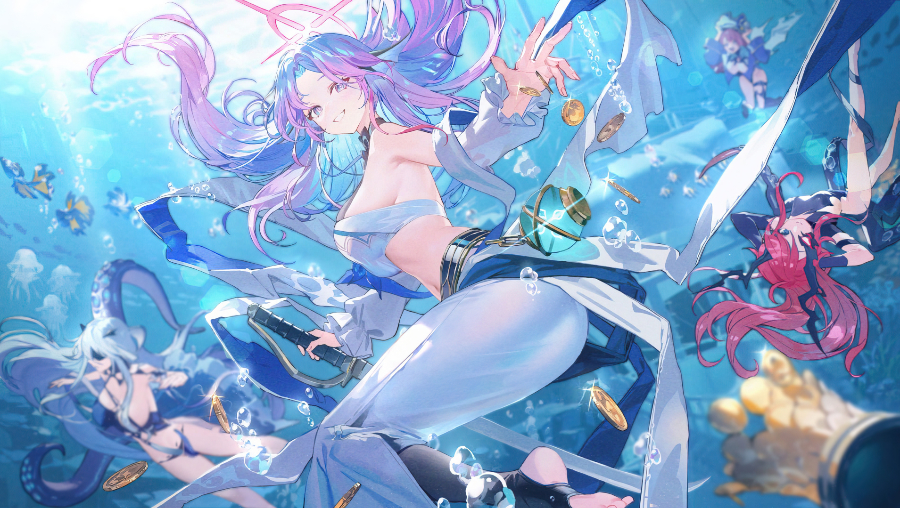

<!-- Header -->
<h1 align="center">
  
</h1>

  <em>「 即使是魔法，也有科学无法解释的可爱之处✦ 」</em>

<!-- ✨ 自动裁剪展示图框 ✨ (您可以随时替换 showcase.jpg，不管原图多大，它都会自动截取成一条好看的横幅) -->

  

<!-- 纯 HTML 三栏表格结构：外部强制居中 -->

<table width="100%"><tr><td width="28%" align="center" valign="top">   <strong>Pakchuii</strong> China 🇨🇳 · CS Student     </td><td width="42%" valign="top"><h3>✦ About Me</h3><pre lang="yaml" style="background-color: #f8fafc; border: 1px solid #e2e8f0;"><code>name: "Pakchuii"
identity: "Student"
personality: "INTP-T · 内向但话多"
status: "大概在摸鱼..."

hobbies:
  - 🎮 Gaming (碧蓝档案 / 原神)
  - 🎨 Anime & Illustration
  - ☕ Coffee Addiction
  - 🎵 Music 

traits:
  - 擅长深夜思考人生
  - 可以连续 12 小时不出门
  - 猫派 🐈</code></pre></td><td width="30%" valign="top"><h3>✦ Currently...</h3>
🎧 <b>Listening to:</b> &nbsp;&nbsp;<i>Unwelcome School - Blue Archive</i>

📖 <b>Watching:</b> &nbsp;&nbsp;<i>葬送的芙莉莲</i> / <i>孤独摇滚!</i>

🎮 <b>Main Quest:</b> &nbsp;&nbsp;努力把学分修完...

🍂 <b>Favorite Season:</b> &nbsp;&nbsp;秋天 (因为可以穿外套)

🔋 <b>Energy Level:</b> &nbsp;&nbsp;<code>[████▒▒▒▒▒▒] 40%</code>
</td></tr></table>

<!-- Personality Tags -->

  
  
  
  
  

<!-- ✨ GitHub Stats: Light & Fresh Theme ✨ -->

  
  

<!-- Footer Banner -->

  

  ✦ Built with coffee and anime magic ✦

