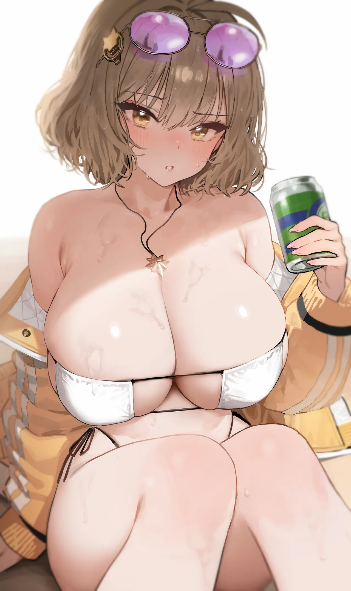

<!-- 全局包裹并开启圆体魔法 -->

  <!-- Header SVG & Banner -->
  <h1 align="center">
    
  </h1>
  

    <em>「 即使是魔法，也有科学无法解释的可爱之处 💠 」</em>
  

  

  

     ┈┈┈┈┈┈┈┈┈┈┈┈ ✧ 💠 ✧ ┈┈┈┈┈┈┈┈┈┈┈┈ 
  

  <!-- THE TRIPLE-COLUMN DASHBOARD LAYOUT -->
  <table width="100%" style="border-collapse: collapse; border: none; background-color: #FAFDFF; border-radius: 16px; box-shadow: 0 4px 12px rgba(0,0,0,0.03);">
    <tr>
      <!-- ================= 🎀 左面板：身份与标签 ================= -->
      <td width="23%" align="center" valign="top" style="border-right: 2px dashed #BAE6FD; padding: 15px;">
        
          
        <strong style="font-size: 1.3em; color: #0284C7;">Pakchuii</strong> 
        China 🇨🇳 · CS Student
          

        <!-- 蔚蓝档案小人动态 GIF 挂件 -->
        
          

         
         
        
          

        <h3 style="color: #00AEEF; margin-bottom: 5px;">✦ Tags</h3>
         
         
         
         
        
      </td>

      <!-- ================= 💻 中面板：系统日志与统计 ================= -->
      <td width="55%" valign="top" style="padding: 15px 25px;">
        <h3 style="color: #00AEEF; margin-top: 0;">
           System Log
        </h3>
        <pre lang="yaml" style="background-color: #F0F9FF; border: 1px solid #BAE6FD; color: #1E3A8A; border-radius: 8px; padding: 12px; font-size: 0.9em; box-shadow: inset 0 2px 4px rgba(0,174,239,0.05); font-family: 'TsukuARdGothic-Regular', 'Nunito', 'YouYuan', '幼圆', monospace;"><code>name: "Pakchuii"
club: "Computer Science"
status: "大概在摸鱼..."

hobbies:
  - 🎮 ALL系杂食党
  - 🎨 正在学习中
  - ☕ 摄取咖啡因
  - 💻 偶尔敲敲键盘

skills:
  - 擅长深夜思考人生
  - 具有 12H 宅家抗性
</code></pre>
         
        <h3 style="color: #00AEEF;">
           Terminal Stats
        </h3>
        

          
            
          
        

        <h3 style="color: #00AEEF;">
           Activity Graph
        </h3>
        <!-- 新增带有书写动画效果的代码提交图 -->
        
      </td>

      <!-- ================= 📸 右面板：副屏状态与相册 ================= -->
      <td width="22%" valign="top" align="center" style="border-left: 2px dashed #BAE6FD; padding: 15px;">
        <h3 style="color: #00AEEF; margin-top: 0;">
           Sync...
        </h3>
        

          🎧 <b style="color:#0284C7;">Music:</b> &nbsp;&nbsp;<i>Nine Point Eight</i>  
          📺 <b style="color:#0284C7;">Watch:</b> &nbsp;&nbsp;<i>金牌得主</i>  
          📜 <b style="color:#0284C7;">Task:</b> &nbsp;&nbsp;修完学分...  
          🍃 <b style="color:#0284C7;">Fav:</b> &nbsp;&nbsp;夏天  
          ☕ <b style="color:#0284C7;">咖啡 LV:</b> &nbsp;&nbsp;<code>[████▒▒▒] 40%</code>
        

         
        <h3 style="color: #00AEEF; line-height: 1.2;">
           Momotalk
        </h3>
        <!-- 照片墙现已变为右侧的纵向朋友圈/拍立得流 -->
        
        
        
      </td>
    </tr>
  </table>

  

     ┈┈┈┈┈┈┈┈┈┈┈┈ ✧ 💠 ✧ ┈┈┈┈┈┈┈┈┈┈┈┈ 
  

  <!-- ✨ Footer Video Banner ✨ -->
  

    
  

  

    ✦ Welcome to SCHALE Terminal · 相信的心就是你的魔法 ✦
  

